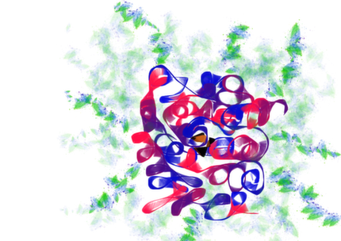
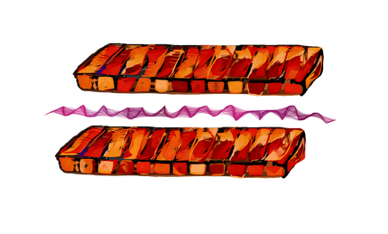

.. _radiationDamage:

*************************************
Radiation Damage Diffraction Patterns
*************************************

.. _installing-docdir:

Introduction
===================================================

SingFEL can simulate the time-evolution of the photon field of a protein sample
undergoing radiation damage. The damage is defined in a PMI module. 

Setting up CUDA for generating diffraction patterns
===================================================

You need to mask GPUs by setting CUDA_VISIBLE_DEVICES. If you have multiple GPUs::

  export CUDA_VISIBLE_DEVICES=0,1    Devices 0 and 1 will be visible
  
If you have one GPU::

  export CUDA_VISIBLE_DEVICES=0      Devices 0 will be visible
  
If you have no GPUs::
  
  export CUDA_VISIBLE_DEVICES=-1
    
The statically.

